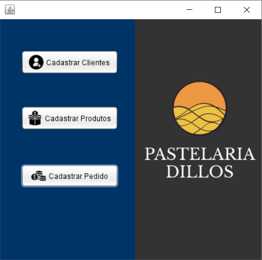
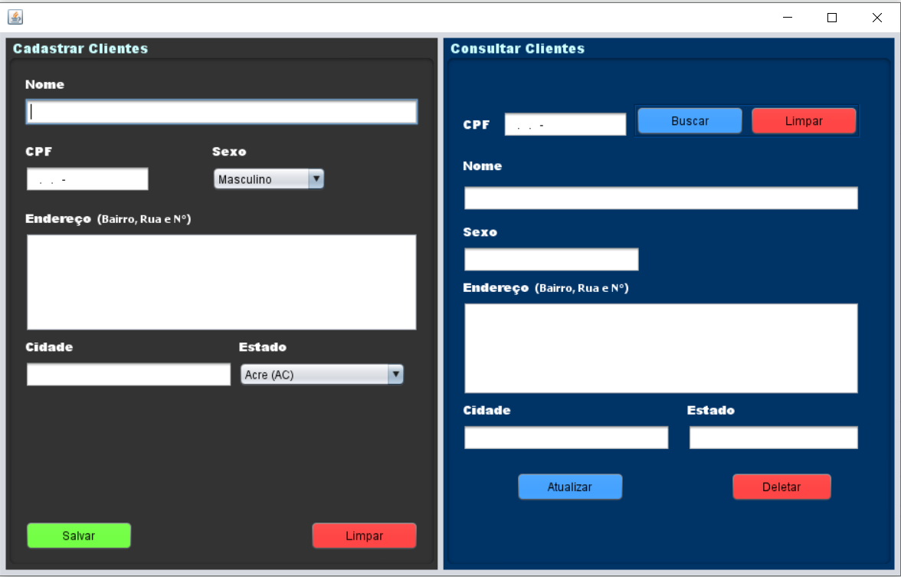
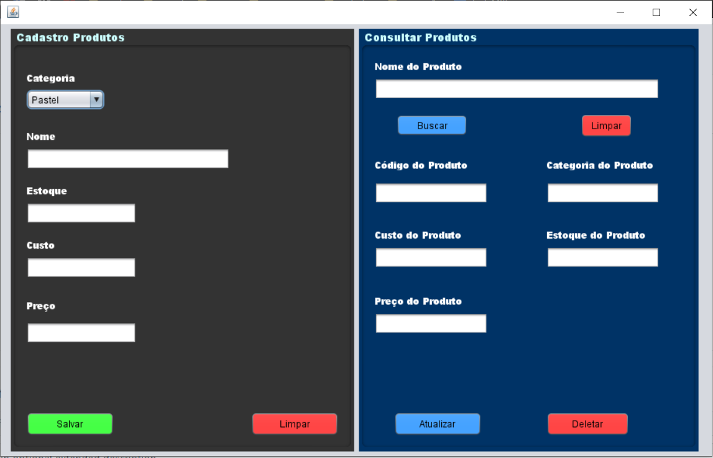
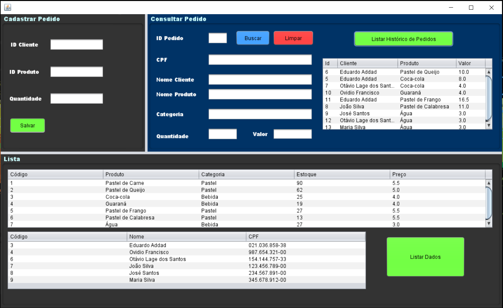
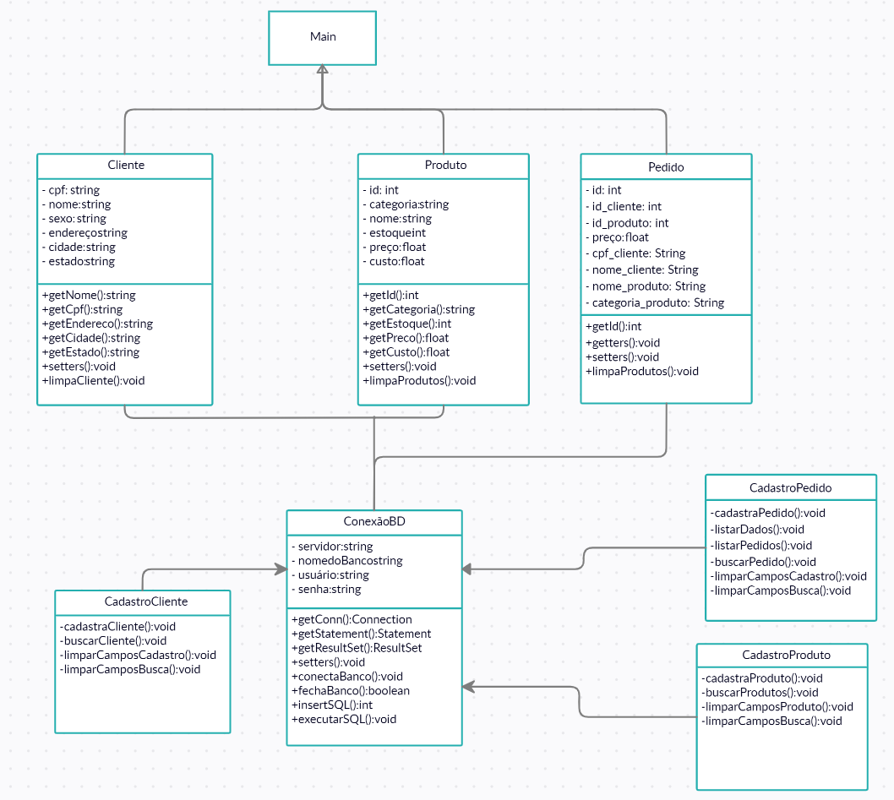

 <h1 align= "center">:warning: CADASTRO/CONSULTA DE CLIENTE/PRODUTO (JAVA):warning: </h1> 

<i>Sistema de cadastro e busca de clientes/produtos, feito em Java usando JFRAME, POO e MYSQL.
</i>

<i>O programa feito usando JFRAME permite à pastelaria cadastrar, editar, apagar e consultar um novo cliente, produto ou pedido.
</i>

<i>Toda a aplicação, possui ligação direta a um Banco de Dados MySQL, salvando cada ação realizada no sistema.
</i>

<h3>:dart: Etapas do Projeto:</h3> 

- :white_check_mark: Interface Gráfica
- :white_check_mark: Cadastro de Usuário
- :white_check_mark: Funcionalidade dos Botões
- :white_check_mark: Conexão com o Banco de Dados
- :white_check_mark: Busca de clientes ou produtos 
<h1 align= "center">:gem: Demostração do programa :gem:</h1>

<h3 align="center">:white_check_mark: Tela Splash</h3>

<h3 align="center">:white_check_mark: Tela de Menu</h3>

<h3 align="center">:white_check_mark: Tela de Cadastro/Consulta de Clientes</h3>

 

<h3 align="center">:white_check_mark: Tela de Cadastro/Consulta de Produtos</h3>
 

  

<h3 align="center">:white_check_mark: Tela de Cadastro/Consulta de Pedido</h3>
 

  
  
<h3 align="center">:white_check_mark: Diagrama Relacional do Banco de Dados:</h3> 

  
 
<h3 align="center">:white_check_mark: Diagrama De Classe:</h3> 

  
 
